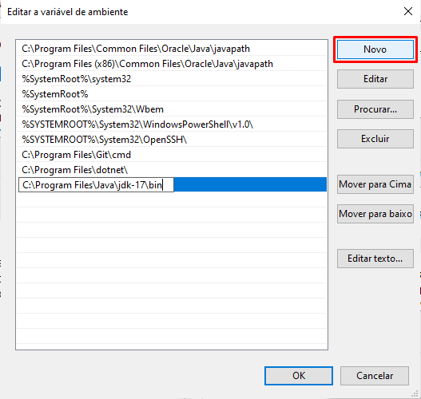

# Nesse preparando o ambiente vamos instalar o JDK para começarmos a desenvolver nossos primeiros programas em Java!

### O JDK (Java Development Kit) é um conjunto de ferramentas e bibliotecas de software que permite o desenvolvimento de aplicativos Java.

<br>

## Linux

<br>

1) No terminal, vamos executar o seguinte comando para atualizar a lista de pacotes disponíveis para download nos repositórios do sistema:

```
sudo apt update
```


2) Feito isso, agora vamos instalar a versão 17 do JDK através do comando:

```
sudo apt install openjdk-17-jdk
```
<br>

3) Dessa forma, o sistema irá baixar e instalar o pacote OpenJDK 17 JDK, permitindo que o usuário comece a desenvolver aplicativos Java no Linux. Terminado esse processo de instalação, agora precisamos configurar a variável de ambiente <b>JAVA_HOME</b>, utilizada para indicar o caminho de instalação do JDK. Em uma tradução literal seria o “lar do java” e ela será necessária para utilizarmos os recursos do JDK como o <b>javac</b>.

Para isso, iremos executar o comando `sudo update-alternatives --config java` que mostrará o caminho onde o JDK foi instalado.

Agora, precisamos copiar esse caminho até /bin, por exemplo: `/usr/lib/jvm/java-17-openjdk-amd64/bin` e digitar no seu terminal o comando: `export JAVA_HOME=`, sendo que após o sinal de igual, sem deixar espaços, cole o caminho que você copiou da instalação do JDK.

Por exemplo:

```
export JAVA_HOME=/usr/lib/jvm/java-17-openjdk-amd64/bin

```

<br>

Vamos pressionar a tecla “enter” e pronto, o JDK está instalado e configurado. Para testá-lo, digite os seguintes comandos no terminal:


```
javac -version
java -version

```

### Mac

1) Para instalar no Mac, podemos acessar o site da [Oracle](https://www.oracle.com/java/technologies/downloads/#jdk17-mac) ou buscar no navegador por “Java Download Oracle” e acessar o primeiro link.

2) Agora, precisamos escolher a versão do Java. Neste curso vamos utilizar o Java 17 LTS, por ser a versão de suporte de longo prazo mais recente para a plataforma Java SE.


3) Selecione o Mac como sistema operacional e faça o download.


<br>

### Windows


1) Para instalar no Windows, podemos acessar o site da [Oracle](https://www.oracle.com/java/technologies/downloads/#jdk17-mac) ou buscar no navegador por “Java Download Oracle” e acessar o primeiro link.

2) Agora, precisamos escolher a versão do Java. Neste curso vamos utilizar o `Java 17 LTS`, por ser a versão de suporte de longo prazo mais recente para a plataforma Java SE.


3) Selecione o Windows como sistema operacional e faça o download.


4) Após baixado, vamos executar o instalador e prosseguir com a instalação.


5) Após a instalação, vamos testar o nosso Java. Para isso, utilizaremos o prompt de comando. Teste os seguintes comandos e verifique se tudo correu como o esperado:

```
java -version

javac -version

```

Resultado:


### Configurações do PATH no Windows

<br>

1) Vá em painel de controle e procure por “Sistema”, após isso, clique em “Configurações avançadas do sistema”.


2) Na aba "Avançado", clique em “Variáveis de Ambiente”.


3) Agora foi aberta uma nova janela na parte inferior da tela, selecione a variável de ambiente chamada “Path” e clique em “Editar”.


4) Nessa nova janela, clique no botão “Novo” e na linha que foi selecionada, coloque o caminho para seu diretório bin dentro da pasta jdk, que está dentro da pasta Java.




5) Após feito, feche o prompt de comando e abra novamente. Teste os seguintes comandos:


```
java -version

javac -version

```


### Instalação do IntelliJ

Durante o curso os instrutores utilizam a IDE IntelliJ IDEA, da empresa JetBrains, muito conhecida por desenvolver IDE's e por ser a empresa que criou e mantém uma das linguagens filhas do Java, o Kotlin.

Nesse preparando o ambiente vamos aprender a instalar o IntelliJ, para facilitar o acompanhamento do curso.

Para começar, precisamos entrar na página principal do [IntelliJ](https://www.jetbrains.com/pt-br/idea/), onde encontraremos algo parecido com a imagem abaixo, onde vamos clicar no botão "Baixar":


Após clicar, seremos levados à página de downloads da ferramenta, que apresenta opções para os sistemas Windows, Linux e MacOS em um menu que deve ser clicado baseado em seu sistema operacional. Logo abaixo do menu vemos duas opções de download, que se tratam das duas versões da IDE: a edição Ultimate e Community.

A versão Ultimate apresenta mais recursos, como suporte a mais linguagens e gerenciamento de banco de dados embutido, no entanto é paga; A edição Community é a opção gratuita da ferramenta e apresenta todos os recursos que vamos precisar durante o curso, por este motivo vamos instalar esta versão.

Para fazer o download o IntelliJ Community Edition, vamos clicar no botão "Baixar" como apresentado na imagem abaixo:


Após clicar em "Baixar", será feito o download da ferramenta e sua instalação varia com o sistema operacional.

<br>

### Windows


No Windows será baixado o instalador da ferramenta, com nome similar a "ideaIC-2022.3.2", dependendo da versão baixada. Para iniciar a instalação, vamos executar esse arquivo.

Após executado, vai ser aberta uma janela de instalador padrão do Windows, como na imagem abaixo, onde vamos clicar no botão "Next":


Que vai nos direcionar para uma página onde vamos selecionar em qual pasta será feita a instalação. Aqui nós podemos deixar no diretório padrão e novamente clicar no botão "Next", como mostrado abaixo:


Após isso, seremos direcionados para uma tela com várias caixas de seleção, com opções de instalação da ferramenta. São opções referentes à se queremos criar um atalho no desktop, adicionar o IntelliJ ao PATH, para que possa ser acessado via linha de comando, adicionar uma nova ação ao menu de contexto, para que quando clicarmos em um arquivo com o botão direito do mouse aparece a opção de abri-lo no IntelliJ, e criar associações aos tipos de arquivo, para que eles sejam abertos diretamente na IDE.

Aqui podemos selecionar todas as caixas, como na imagem:


Caso você não queira marcar todas as caixas, a mais importante é na aba "Create Associations", onde vamos criar as associações dos arquivos `.java` ao IntelliJ, como destacado na imagem acima. Após marcar as opções desejadas, podemos seguir clicando no botão "Next".

Após isso, vamos para a seleção da pasta do menu iniciar onde poderemos localizar a nossa IDE. Nessa tela podemos simplesmente deixar a opção padrão e clicar no botão "Install" para instalar a ferramenta no computador, como mostrado abaixo:


Será iniciada a instalação dos arquivos da ferramenta, o que pode demorar um tempinho. Hora de pegar um café e esperar!

Ao final da instalação, seremos direcionados a uma tela com a opção de reiniciar o computador agora ou depois. É recomendável reiniciar o computador, para que as alterações no PATH funcionem corretamente, no entanto a ferramenta já pode ser utilizada mesmo sem a reinicialização.

Por fim, podemos clicar no botão "Finish", para finalizar o instalador, como na imagem abaixo:


E prontinho, o IntelliJ já pode ser utilizado para desenvolver suas aplicações!

<br>

### Linux

Em sistemas Linux, o arquivo baixado é um arquivo compactado já com a IDE pré-instalada. Para conseguir executá-la, precisamos navegar até a pasta onde o arquivo baixado está e descompactá-lo com o comando:

```
tar -xf <arquivoBaixado>.tar.gz

```

O nome do arquivo pode variar conforme a versão baixada, mas sempre segue um padrão como "ideaIC-2022.3.2.tar".

Após descompactar o arquivo, será criada uma pasta com nome similar a "idea-IC-xxx.xxx.xx" onde os "x" representam a versão da ferramenta. Para abrir a IDE, é necessário navegar até a pasta, através do comando:

```
cd idea-IC-xxx.xxx.xx

```

E acessar a subpasta "bin", a partir do comando:
```
cd bin
```

Onde está localizado o arquivo "idea.sh", que é o script de inicialização do IntelliJ. Agora, para abrir a IDE basta rodar o script com o comando:

```
./idea.sh
```


Que vai inicializar a ferramenta que já está pronta para ser utilizada!

<br>

### MacOS

No MacOS, assim como no Windows, é baixado um instalador com a instalação ".dmg" e a instalação é bastante simples.

Para isso, vamos navegar até a pasta de download do arquivo e executá-lo com duplo clique. Será aberta uma janela pedindo para que o ícone do IntelliJ seja arrastado até o ícone da pasta Applications, como mostrado na imagem:


Após arrastar, vai ser iniciado o processo de cópia de arquivos e a IDE será instalada. Ao término da instalação basta pesquisar no menu de pesquisa por "IntelliJ" e executar o programa "IntelliJ IDEA CE", que já teremos acesso aos recursos da ferramenta.
